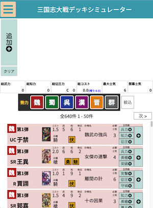
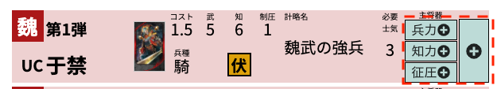
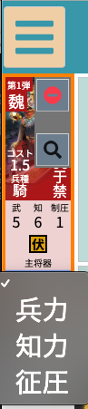
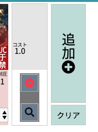
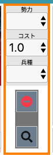
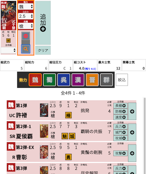

# このツールについて

アーケードゲーム [三国志大戦](http://www.sangokushi-taisen.com) のデッキシミュレーターです。

## 注意

- 本ツールは個人が作成した非公式のツールです。

## 使い方

武将一覧から右横の方にあるボタンを押すとデッキに武将が追加されます。主将器を選んだ場合は主将器が選択状態で追加されます。

主将器はデッキに追加後に変更できます。

追加ボタンを押すと武将を指定しないでデッキにカードが追加されます。

武将を指定しない場合、勢力・コスト・兵種を設定できます。

虫眼鏡マークを押すと選択中のカードの勢力・コスト・兵種で検索ができます。

## その他

### 動作対象ブラウザ

- Google Chrome
- Firefox
- Edge(Windows)
- Safari(Mac)
- Safari(iOS)
- Android Chrome

### 使用しているライブラリについて

[こちら](licenses.md) をご確認ください。

### Google Analytics ついて

本ツールは機能改善の参考にするため、Google Analytics を使用して
機能の使用状況や使用されているブラウザ・OSなどの情報を取得しています。
Google Analytics はその解析のために Webブラウザの Cookieを使用しています。
収集するデータは匿名のもので個人を特定するものではありません。
詳しくは[こちら](https://policies.google.com/technologies/partner-sites?hl=ja)をご確認ください。
